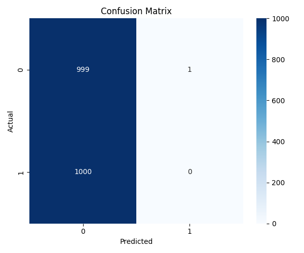

# Detecting-Face-Spoofing-
Here’s a **professional, well-structured README** for your GitHub repository [`Detecting-Face-Spoofing`](https://github.com/shaikaamer/Detecting-Face-Spoofing), designed to align with your project rubric and impress evaluators:

---

# 🛡️ Detecting Face Spoofing via Autoencoder and MobileNetV2

## 📌 Project Overview

Face spoofing is a significant security challenge for biometric authentication systems. This project addresses the detection of spoofed facial images—such as printed photos or digital replays—using a hybrid deep learning approach combining an autoencoder for anomaly detection and a MobileNetV2-based classifier.

✅ **Course:** TME 6017 – Deep Learning  
✅ **University:** [Your University Name]  
✅ **Instructor:** [Instructor Name]  
✅ **Author:** [Your Name]  
✅ **Date:** April 2025

---

## 📂 Dataset

- **Source:** [CelebA-Spoof Dataset on Kaggle](https://www.kaggle.com/datasets/attentionlayer241/celeba-spoof-for-face-antispoofing/data)
- **Structure:** Images classified as `live` or `spoof`
- **Size:** Subset curated for training in low-resource settings
- **Preprocessing:**
  - Resizing to 150x150
  - RGB conversion
  - Normalization via `ImageDataGenerator`

---

## 🧠 Methodology

### 1. **Autoencoder (Anomaly Detection)**
- Trained only on live faces to learn the structure of genuine inputs.
- Reconstruction error is used to detect spoofed samples.

### 2. **MobileNetV2 Classifier**
- Fine-tuned using transfer learning.
- Classifies images into `live` or `spoof`.

### 3. **Flask Web App**
- Allows real-time spoof detection by uploading an image.
- Displays prediction and reconstruction results.

---

## 🏗️ Project Structure

```
├── app/
│   ├── static/
│   ├── templates/
│   ├── autoencoder.keras
│   ├── classifier.keras
│   └── app.py
├── notebooks/
│   ├── training_autoencoder.ipynb
│   ├── training_classifier.ipynb
├── data/
│   ├── train/
│   ├── test/
│   └── val/
├── outputs/
│   ├── roc_curve.png
│   ├── confusion_matrix.png
│   ├── reconstruction_examples.png
├── requirements.txt
└── README.md
```

---

## 🚀 How to Run

### 1. Clone the Repo
```bash
git clone https://github.com/shaikaamer/Detecting-Face-Spoofing.git
cd Detecting-Face-Spoofing
```

### 2. Set Up Environment
```bash
pip install -r requirements.txt
```

### 3. Launch Flask App
```bash
cd app
python app.py
```

---

## 📊 Results & Visualizations

- **Classifier Accuracy:** >80% on validation data
- **Reconstruction Error Threshold:** ~0.015
- **Visuals Included:**
  - ROC Curve for Autoencoder
  - Confusion Matrix
  - Reconstruction Examples
  - Accuracy/Loss Curves for Training

---

## 📌 Sample Outputs

| Original vs Reconstructed | ROC Curve | Confusion Matrix |
|---------------------------|-----------|------------------|
|  |  |  |

---

## ✅ Evaluation Highlights (for TME 6017 Rubric)

| Section | Included | Notes |
|--------|----------|-------|
| Code & Repo | ✅ Yes | All files structured and documented |
| Results | ✅ Yes | Plots and metrics provided |
| Flask Integration | ✅ Yes | App included with full setup |
| Instructions | ✅ Yes | Clear steps to run and reproduce |

---

## 📈 Future Improvements

- Add Grad-CAM for model explainability.
- Incorporate attention mechanisms into the autoencoder.
- Extend to video-based spoof detection.

---

## 📬 Contact

For feedback or collaboration:  
📧 [skaamershaik@gmail.com]  


---
